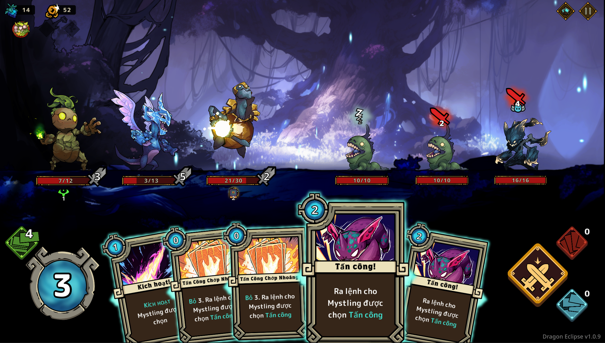

<div align="center">

# DragonEclipse

**Unity client for _Dragon Eclipse_ — a turn-based roguelike deck-builder.**



<br />

[](https://unity.com/releases/editor/archive)
[](https://docs.unity3d.com/Packages/com.unity.render-pipelines.universal@14.0)
[](#build)
[](#project-info)

</div>

---

## Project Info

| Item | Value |
| --- | --- |
| Product name | Dragon Eclipse |
| Developer | Fardust |
| Game version | `1.0.9` |
| Unity Editor | **2022.3.62f3** (revision `96770f904ca7`) |
| Render pipeline | Universal RP `14.0.12` (embedded under `Packages/`) |
| Scripting backend | Mono / .NET Standard 2.1 |
| Target platform | Windows x64 (Standalone) |
| Steam App ID | `2626860` (`steam_appid.txt`) |
| Languages | Multi-language via Unity Localization + additional locale bridge |

---

## Requirements

- **Unity 2022.3.62f3** — this exact version is required. Opening the project in Unity 6 or another LTS release breaks the URP 14 package references and asset GUIDs.
- **Visual Studio 2022** or **JetBrains Rider**, with the Windows Build Support module installed.
- **Free disk space:** ~25 GB (`Assets` ≈ 2.2 GB, generated `Library` ≈ 16 GB after the first import).
- **RAM:** 16 GB or more recommended for the initial import.

---

## First-Time Setup

> [!IMPORTANT]
> The first import (when no `Library/` folder exists yet) **must** be run with the `-disable-assembly-updater` flag.
> Without it, the API Updater hangs indefinitely on `Awaken.Root.dll`.

```powershell
& "C:\Program Files\Unity\Hub\Editor\2022.3.62f3\Editor\Unity.exe" `
    -projectPath "E:\Project\Client\DragonEclipse\client" `
    -disable-assembly-updater
```

Once `Library/` has been built, the project can be opened normally through Unity Hub.

The initial import takes a while — it imports every asset and compiles all shaders. Let it run until the Editor shows the Scene view.

---

## Project Structure

```
client/
├── Assets/
│   ├── Awaken/                  # Original game data & content (Localization, configs…)
│   ├── Data/                    # Gameplay ScriptableObjects: Cards, Combat, Blessings, Achievements…
│   ├── Editor/                  # Custom editor tooling
│   │   ├── AssetRipperPatches/  # Post-import asset fixups
│   │   ├── SteamAppIdPostBuild.cs
│   │   └── SteamDisablePatcher.cs
│   ├── Plugins/                 # ~300 Awaken.* assemblies + third-party libraries
│   ├── Resources/               # TMP, Odin, DOTween, SRDebugger, ExtraLocales…
│   ├── Scenes/                  # Entry, MainMenu, Map, Combat
│   ├── Scripts/                 # Editable C# source
│   │   ├── Assembly-CSharp/
│   │   └── ExtraLocales/        # Additional-locale bridge (see below)
│   ├── Shader/                  # Full shader source (94 shaders)
│   └── StreamingAssets/aa/      # SHIPPED Addressables bundles — do not rebuild
├── Packages/                    # URP 14.0.12, Shader Graph, VFX Graph, Input System (embedded)
├── ProjectSettings/
└── steam_appid.txt
```

---

## Scenes

| Scene | Role |
| --- | --- |
| `Entry.unity` | Bootstrap scene, initializes core systems |
| `MainMenu.unity` | Main menu |
| `Map.unity` | Journey map (559 Places) |
| `Combat.unity` | Turn-based combat encounter |

---

## Localization

The game uses **Unity Localization**, with string tables loaded through Addressables.

Additional translations are injected through a dedicated bridge so that **Addressables never has to be rebuilt**:

- `Assets/Resources/ExtraLocales.asset` — references the extra `Locale` and its list of `StringTable` assets.
- `Assets/Scripts/ExtraLocales/ExtraLocaleInstaller.cs` — runs on `RuntimeInitializeOnLoadMethod`, registers the new locale and installs a custom `ITableProvider`. For every other language the provider returns an empty handle, so Localization falls back to the original Addressables load path.

Adding a new language means adding a `Locale` plus its `StringTable` assets to `ExtraLocales.asset` — no bundle changes required.

---

## Build

The only supported build target is **Windows x64 Standalone**.

```
File ▸ Build Settings ▸ Windows, Mac, Linux ▸ Target Platform: Windows ▸ Architecture: x86_64 ▸ Build
```

`SteamAppIdPostBuild.cs` automatically copies `steam_appid.txt` into the build output folder.

> [!WARNING]
> **Never run _Build Addressables_.** The contents of `Assets/StreamingAssets/aa` are the shipped bundles and the project's source of truth for game data — rebuilding overwrites them with unrecoverable data loss.

---

## Important Notes

| Do not | Reason |
| --- | --- |
| Open the project in Unity 6 or any other Unity version | Breaks URP 14 package references and asset GUIDs |
| Rebuild Addressables | `StreamingAssets/aa` holds the shipped bundles with original data that cannot be regenerated |
| Replace or rename DLLs in `Assets/Plugins` without checking GUIDs | Every script reference is GUID-based; one wrong file breaks references project-wide |
| Change the URP asset's shader tag | An empty tag makes the shader stripper remove every URP shader at build time — the build renders nothing |
| Build for Android / iOS | Not supported; plugins and bundles are desktop-only |

---

## Copyright

_Dragon Eclipse_ is a product of **Fardust**. All assets, art, audio and game content remain the property of the original developer. This repository exists for research and internal localization purposes only and is not intended for redistribution.
